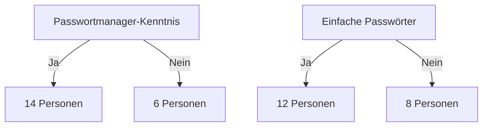

#Chancen und Risiken des Projektes

## Chancen 

### Marktanalyse
- **Online-Recherche**:  
  -	Unsere Online - Recherche ergab, dass es zwar viele Anbieter auf dem Markt gibt,die Passwort Manger zu Verfügung stellen. Dabei werden aber die wesentlichsten und wichtigsten Punkte nicht geklärt oder sind nicht angeführt:  
  - Datenschutz  
  - Sicherheit  
  - Speicherort der Daten und deren Behandlung  
  - Zugriffsmöglichkeiten von Drittanbietern  

- **Umfragen**:  
  - Eine **anonyme Online-Umfrage** sowie Interviews mit Passanten wurden durchgeführt, um Meinungen zu Passwortmanagern zu erheben.  
  - Die gestellten Fragen lauteten:  
    - Wie viele Passwörter besitzen Sie ungefähr?  
    - Wie viele unterschiedliche Passwörter nutzen Sie?  
    - Verwenden Sie einfache Passwörter?  
    - Kennen Sie Passwortmanager?  

### Ergebnisse der Umfrage
- **Altersgruppe 16–50 Jahre**:  
  - Passwortmanager sind weitgehend bekannt, doch es herrscht wenig Vertrauen, insbesonders in Bezug auf Datenschutz und möglichen Datenmissbrauch. 

- **Altersgruppe über 50 Jahre**:  
  - Passwortmanager sind weniger bekannt.  
  - Weniger Passwörter werden genutzt, da diese Altersgruppe tendenziell seltener auf Online-Plattformen angemeldet ist.  
  - Meistens wird dasselbe, einfach zu merkende Passwort verwendet, oft mit der minimal erforderlichen Länge.

## Umfrageergebnisse
## Passwortanzahl vs. Unterschiedliche Passwörter

```mermaid
%% Liniendiagramm für Passwortanzahl vs. Unterschiedliche Passwörter
graph TD;
    A18["18 Jahre: 20 Passwörter, 15 unterschiedliche"] -->|20| B18[████]
    A22_1["22 Jahre: 40 Passwörter, 30 unterschiedliche"] -->|40| B22_1[████████]
    A22_2["22 Jahre: 35 Passwörter, 25 unterschiedliche"] -->|35| B22_2[███████]
    A30_1["30 Jahre: 55 Passwörter, 38 unterschiedliche"] -->|55| B30_1[███████████]
    A30_2["30 Jahre: 60 Passwörter, 40 unterschiedliche"] -->|60| B30_2[████████████]
    A35["35 Jahre: 55 Passwörter, 38 unterschiedliche"] -->|55| B35[███████████]
    A40_1["40 Jahre: 50 Passwörter, 35 unterschiedliche"] -->|50| B40_1[█████████]
    A40_2["40 Jahre: 48 Passwörter, 32 unterschiedliche"] -->|48| B40_2[████████]
    A45["45 Jahre: 35 Passwörter, 25 unterschiedliche"] -->|35| B45[███████]
    A50_1["50 Jahre: 20 Passwörter, 10 unterschiedliche"] -->|20| B50_1[███]
    A50_2["50 Jahre: 25 Passwörter, 15 unterschiedliche"] -->|25| B50_2[████]
    A55_1["55 Jahre: 10 Passwörter, 7 unterschiedliche"] -->|10| B55_1[█]
    A55_2["55 Jahre: 12 Passwörter, 8 unterschiedliche"] -->|12| B55_2[██]
    A60_1["60 Jahre: 10 Passwörter, 7 unterschiedliche"] -->|10| B60_1[█]
    A60_2["60 Jahre: 8 Passwörter, 5 unterschiedliche"] -->|8| B60_2[█]
    A65["65 Jahre: 8 Passwörter, 5 unterschiedliche"] -->|8| B65[█]
    A70_1["70 Jahre: 5 Passwörter, 3 unterschiedliche"] -->|5| B70_1[ ]
    A70_2["70 Jahre: 6 Passwörter, 4 unterschiedliche"] -->|6| B70_2[ ]
```



```markdown


### Fazit der Analyse
- Der Markt benötigt ein **zuverlässiges System**, das folgende Punkte abdeckt:  
  - Datenschutz  
  - Sicherheit  
  - Einfache Bedienung  
  - Transparenz (keine Einsicht durch Drittpersonen)  

- **Zielgruppe erweitern**:  
  Es ist notwendig, auch die ältere Altersgruppe von den Vorteilen solcher Applikationen zu überzeugen, um Akzeptanz und Vertrauen zu schaffen.

### Herausforderung: Benutzerfreundlichkeit und Interface-Design
Eine häufige Schwachstelle der bestehenden Lösungen ist die Gestaltung der Benutzeroberfläche (UI) und die Benutzerfreundlichkeit (UX). 
Viele in der Ausgangssituation genannten Passwortmanager sprechen entweder ausschließlich technisch veranlagte Nutzer an oder sind durch überladene Interfaces unnötig komplex.

- **Überladene Interfaces**: Anbieter wie Dashlane und LastPass integrieren zahlreiche Zusatzfunktionen (z.B.: Dark-Web-Monitoring oder VPN's), die den eigentlichen Zweck der Software (sichere Passwortverwaltung) in den Hintergrund rücken.
- **Eingeschränkte Zugänglichkeit**: Lösungen wie KeePassXC oder Bitwarden sind technisch und flexibel, aber für Anfänger oft schwer verständlich.
- **Veraltetes Design**: Manche Anbieter (z. B. LastPass) setzen auf eine veraltete Optik, die nicht den Ansprüchen moderner Software-Nutzer entspricht.

## Risiko

### Sicherheitsaspekte
- **Sicherheitslücken**:  
  Ein potenzielles Risiko besteht darin, dass Sicherheitslücken auftreten oder sich Drittpersonen unerlaubt Zugriff verschaffen.  

- **Trust-Prinzip**:  
  Das Vertrauen der Nutzer darf nicht gebrochen werden, da dies den Erfolg des Systems gefährden würde.  

### Verfügbarkeit ?!
- **24/7 Verfügbarkeit**:  
  - Das System muss jederzeit erreichbar sein.  
  - Ein Backup-Server sollte in Betracht gezogen werden, um **örtliche Redundanz** zu gewährleisten.
