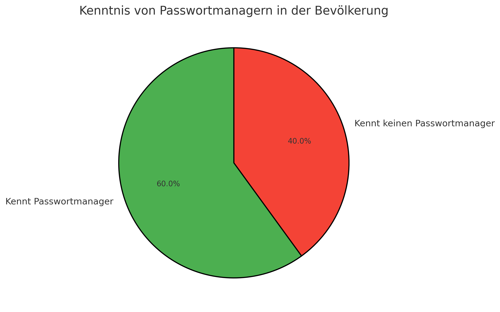

# Chancen und Risiken des Projektes

## Chancen 

### Marktanalyse
Unsere Online-Recherche ergab, dass es zwar viele Anbieter auf dem Markt gibt, die Passwortmanager zur Verfügung stellen. Dabei werden aber wesentliche Punkte oft nicht geklärt oder nicht ausreichend behandelt:

- **Datenschutz**: Viele Anbieter speichern Passwörter in der Cloud, wodurch Nutzer die Kontrolle über ihre Daten verlieren.
- **Sicherheit**: Oft fehlen transparente Sicherheitsmechanismen oder es gab bereits Sicherheitsprobleme (z. B. Datenlecks).
- **Speicherort der Daten**: Viele Nutzer möchten selbst entscheiden, wo ihre Passwörter gespeichert werden, doch die meisten Anbieter bieten keine lokale Lösung an.
- **Zugriffsmöglichkeiten von Drittanbietern**: Einige Lösungen ermöglichen Unternehmen oder Administratoren den Zugriff auf gespeicherte Passwörter, was für viele ein Risiko darstellt.

Diese Erkenntnisse werden durch unsere **Umfrage bestätigt**:

### Umfrageergebnisse
- **Altersgruppe 16–50 Jahre**:  
  - Passwortmanager sind bekannt, aber viele Nutzer haben **Sicherheitsbedenken**.
  - Cloud-Speicherung wird oft kritisch gesehen.
- **Altersgruppe über 50 Jahre**:  
  - Passwortmanager sind weniger bekannt.  
  - Viele nutzen stattdessen **einfache oder wiederverwendete Passwörter** mit minimaler Länge.
  - Es besteht eine hohe Skepsis gegenüber digitalen Passwortlösungen.

➡ **Fazit:** Es gibt eine klare Marktlücke für eine **einfache, sichere und lokal gespeicherte Lösung**.

### Umfrageergebnisse (20 Befragte Personen)

| Bar-Chart | Pie-Chart |
|------------------------|---------------------------|
|  |  |

### Zielgruppe erweitern
Die Umfrage zeigt, dass ältere Nutzer Passwortmanager seltener nutzen und eher einfache, wiederverwendete Passwörter bevorzugen.  
Um diese Zielgruppe zu erreichen, sind einfache Bedienbarkeit und Vertrauensbildung entscheidend.

## Risiken

### Sicherheitsaspekte
- **Sicherheitslücken**:  
  Ein potenzielles Risiko besteht darin, dass Sicherheitslücken auftreten oder sich Drittpersonen unerlaubt Zugriff verschaffen.  

- **Trust-Prinzip**:  
  Das Vertrauen der Nutzer darf nicht gebrochen werden, da dies den Erfolg des Systems gefährden würde.  

### Verfügbarkeit
- **Erreichbarkeit der Anwendung**:  
  - Da der Passwortmanager primär lokal arbeitet, muss sichergestellt werden, dass der Zugriff **jederzeit und ohne Internetverbindung** funktioniert.
  - Falls ein optionaler Server später integriert wird, ist eine **Backup-Lösung** nötig, um Datenverlust zu vermeiden.

### Technische Risiken: Benutzerfreundlichkeit & Nutzererfahrung

- **Zu viele Funktionen auf einmal:**  
  - Einige Passwortmanager bieten sehr viele Einstellungen und Extras, was für **unerfahrene Nutzer verwirrend** sein kann.  
  - **Beispiel:** Manche Programme haben komplizierte Menüs, bei denen man erst herausfinden muss, welche Funktionen wirklich wichtig sind.  

- **Schwierige Bedienung für Anfänger:**  
  - Manche Programme sind technisch gut, aber **nicht selbsterklärend**.  
  - Nutzer müssen oft **selbst herausfinden**, wie sie Passwörter speichern oder synchronisieren.  

- **Unübersichtliches oder veraltetes Design:**  
  - Manche Passwortmanager wirken **veraltet** und sind **nicht modern gestaltet**.  
  - Wenn eine Software **nicht ansprechend aussieht oder schwer zu bedienen ist**, nutzen viele sie **nicht gerne**.  

### Fazit
Das Projekt bietet eine **klare Chance**, sich von bestehenden Lösungen abzuheben, indem es sich auf **Datenschutz, einfache Bedienung und lokale Speicherung** fokussiert. Gleichzeitig müssen **technische Herausforderungen** (Benutzerfreundlichkeit, Sicherheitsmechanismen) sorgfältig berücksichtigt werden, um das Vertrauen der Nutzer zu gewinnen und eine nachhaltige Lösung bereitzustellen.
