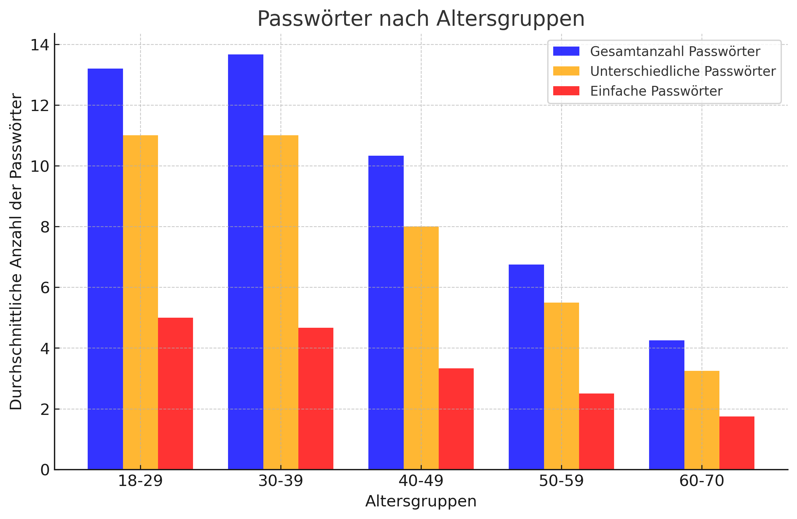

# Chancen und Risiken des Projektes

## Chancen 

### Marktanalyse
Unsere Online-Recherche ergab, dass es zwar viele Anbieter auf dem Markt gibt, die Passwortmanager zur Verfügung stellen. Dabei werden aber wesentliche Punkte oft nicht geklärt oder nicht ausreichend behandelt:

- **Datenschutz**: Viele Anbieter speichern Passwörter in der Cloud, wodurch Nutzer die Kontrolle über ihre Daten verlieren.
- **Sicherheit**: Oft fehlen transparente Sicherheitsmechanismen oder es gab bereits Sicherheitsprobleme (z. B. Datenlecks).
- **Speicherort der Daten**: Viele Nutzer möchten selbst entscheiden, wo ihre Passwörter gespeichert werden, doch die meisten Anbieter bieten keine lokale Lösung an.
- **Zugriffsmöglichkeiten von Drittanbietern**: Einige Lösungen ermöglichen Unternehmen oder Administratoren den Zugriff auf gespeicherte Passwörter, was für viele ein Risiko darstellt.

Diese Erkenntnisse werden durch unsere **Umfrage bestätigt**:

### Umfrageergebnisse
- **Altersgruppe 16–50 Jahre**:  
  - Passwortmanager sind bekannt, aber viele Nutzer haben **Sicherheitsbedenken**.
  - Cloud-Speicherung wird oft kritisch gesehen.
- **Altersgruppe über 50 Jahre**:  
  - Passwortmanager sind weniger bekannt.  
  - Viele nutzen stattdessen **einfache oder wiederverwendete Passwörter** mit minimaler Länge.
  - Es besteht eine hohe Skepsis gegenüber digitalen Passwortlösungen.

➡ **Fazit:** Es gibt eine klare Marktlücke für eine **einfache, sichere und lokal gespeicherte Lösung**.

### Umfrageergebnisse (20 Befragte Personen)

| Bar-Chart | Pie-Chart |
|------------------------|---------------------------|
|  |  |

### Zielgruppe erweitern
Die Umfrage zeigt, dass ältere Nutzer Passwortmanager seltener nutzen und eher einfache, wiederverwendete Passwörter bevorzugen.  
Um diese Zielgruppe zu erreichen, sind einfache Bedienbarkeit und Vertrauensbildung entscheidend.

## Risiken

### Sicherheitsaspekte
- **Sicherheitslücken**:  
  Ein potenzielles Risiko besteht darin, dass Sicherheitslücken auftreten oder sich Drittpersonen unerlaubt Zugriff verschaffen.  

- **Trust-Prinzip**:  
  Das Vertrauen der Nutzer darf nicht gebrochen werden, da dies den Erfolg des Systems gefährden würde.  

### Verfügbarkeit
- **Erreichbarkeit der Anwendung**:  
  - Da der Passwortmanager primär lokal arbeitet, muss sichergestellt werden, dass der Zugriff **jederzeit und ohne Internetverbindung** funktioniert.
  - Falls ein optionaler Server später integriert wird, ist eine **Backup-Lösung** nötig, um Datenverlust zu vermeiden.

### Technische Risiken: Benutzerfreundlichkeit & Nutzererfahrung

- **Zu viele Funktionen auf einmal:**  
  - Einige Passwortmanager bieten sehr viele Einstellungen und Extras, was für **unerfahrene Nutzer verwirrend** sein kann.  
  - **Beispiel:** Manche Programme haben komplizierte Menüs, bei denen man erst herausfinden muss, welche Funktionen wirklich wichtig sind.  

- **Schwierige Bedienung für Anfänger:**  
  - Manche Programme sind technisch gut, aber **nicht selbsterklärend**.  
  - Nutzer müssen oft **selbst herausfinden**, wie sie Passwörter speichern oder synchronisieren.  

- **Unübersichtliches oder veraltetes Design:**  
  - Manche Passwortmanager wirken **veraltet** und sind **nicht modern gestaltet**.  
  - Wenn eine Software **nicht ansprechend aussieht oder schwer zu bedienen ist**, nutzen viele sie **nicht gerne**.  

### Fazit
Das Projekt bietet eine **klare Chance**, sich von bestehenden Lösungen abzuheben, indem es sich auf **Datenschutz, einfache Bedienung und lokale Speicherung** fokussiert. Gleichzeitig müssen **technische Herausforderungen** (Benutzerfreundlichkeit, Sicherheitsmechanismen) sorgfältig berücksichtigt werden, um das Vertrauen der Nutzer zu gewinnen und eine nachhaltige Lösung bereitzustellen.

## Konzepte und Ziele

Das Hauptziel des Passwortmanagers ist es, den Benutzern zu ermöglichen, ihre Passwörter sicher zu speichern und zu verwalten, ohne dass sie sich diese ständig merken müssen. Dabei wird die Sicherheit, Benutzerfreundlichkeit und der Komfort für die Nutzer maximiert, während gleichzeitig der Datenschutz und die Kontrolle gewährleistet wird.

Das Konzept zielt darauf ab, dem Benutzer maximale Sicherheit, Benutzerfreundlichkeit und Flexibilität zu garantieren, während gleichzeitig der Schutz vor Cyberangriffen wie Phishing und Passwortdiebstahl gewährleistet wird. Dabei ergeben sich folgende essentielle Punkte, die bei der Entwicklung beachtet werden müssen:

### Sicherheit

- **Starke Verschlüsselung**: Alle gespeicherten Passwörter und sensible Daten werden mit einer starken Verschlüsselung (AES-256) geschützt. Auch im Falle eines Datenlecks oder Angriffs können wir versichern, dass Daten nicht so ohne Weiteres entschlüsselt werden können.
  
- **Zero-Knowledge-Prinzip**: Durch dieses Prinzip wird sichergestellt, dass der Anbieter keine Daten des Benutzers kennt und solche auch nicht gespeichert oder ausgelesen werden können.
  
- **Sicheres Hauptpasswort**: Das Hauptpasswort, mit dem sich der Benutzer auf dem Passwortmanager einloggt bzw. auf den Passwortspeicher zugreift, wird nicht auf dem Server gespeichert. Daher muss es ausreichend stark und einzigartig sein, um die Sicherheit des gesamten Systems zu gewährleisten. Durch strenge Richtlinien in der Passworterstellung wird sichergestellt, dass das Hauptpasswort stark genug ist.

### Benutzerfreundlichkeit

- **Einfache Handhabung**: Der Passwortmanager wird mit einer benutzerfreundlichen Oberfläche ausgestattet, die es einfach macht, Passwörter zu speichern, zu organisieren und abzurufen. Automatisches Ausfüllen von Anmeldeformularen und Passwortgenerierung wird zusätzlich integriert.
  
- **Automatische Synchronisierung**: Passwörter können auf allen Geräten des Benutzers synchronisiert werden (z. B. PC, Smartphone, Tablet), um den Zugriff zu erleichtern und ohne die Sicherheit zu gefährden.

### Komfort und Flexibilität

- **Passwortgenerierung**: Die Applikation ist in der Lage, starke und zufällig generierte Passwörter zu erstellen, die für jede Website oder Anwendung einzigartig sind. Dies verhindert das Wiederverwenden von Passwörtern.

### Transparenz und Kontrolle

- **Überwachung von Sicherheitslücken**: Es wird die Möglichkeit geben, regelmäßig zu überprüfen, ob gespeicherte Passwörter kompromittiert oder zu schwach sind. Die Benutzer werden in der Software benachrichtigt bzw. in Kenntnis gesetzt, wenn das erzeugte Passwort schon öfter verwendet wird oder es zu schwach ist. Dieser muss mit einer Aktion am Display bestätigen, dass er die Information gelesen und verstanden hat.
  
- **Datenhoheit**: Der Benutzer hat jederzeit die Kontrolle über seine gespeicherten Daten. Datenschutzrichtlinien werden transparent und nachvollziehbar sein, sodass der Benutzer verstehen kann, wie seine Daten verarbeitet und gespeichert werden.

